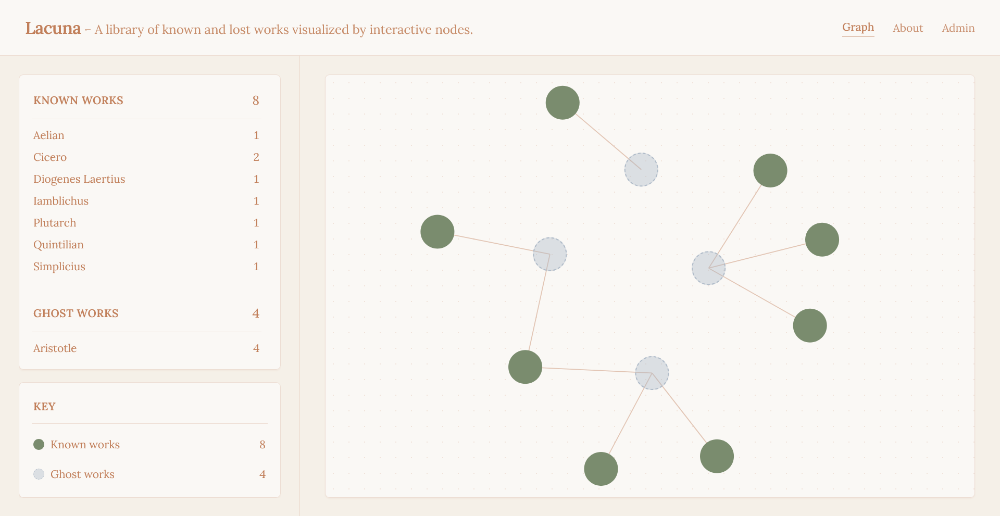
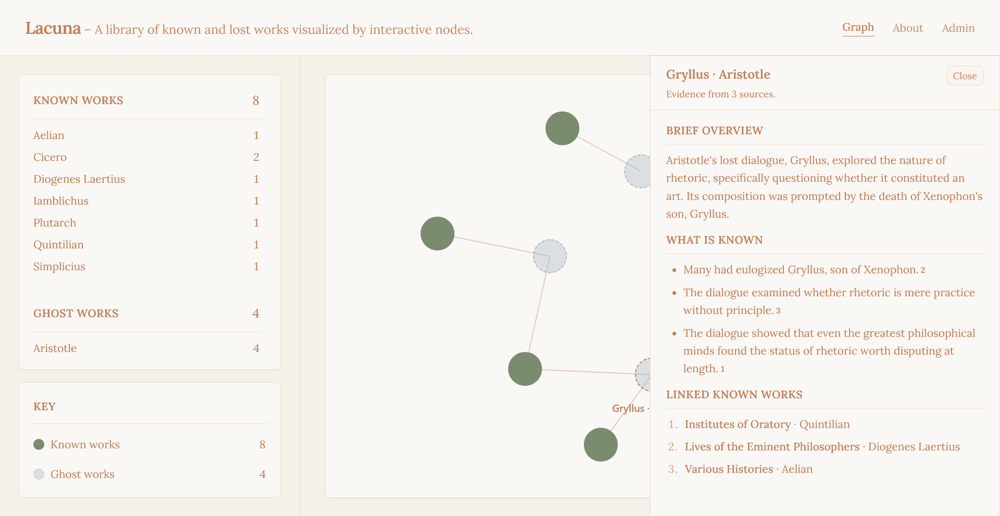

# Lacuna

License: MIT

---



## Problem

About 99% of ancient Greek literature has been lost to history. For example:

- Of the 123 plays Sophocles wrote, we have 7.
- Of Aeschylus's roughly 90 plays, we have 7.
- Of Euripides's ~90 plays, we have 19.
- Aristotle is thought to have written around 200 works. We have about 31.

For many lost works, their existence is solely known or understood through reference and allusion. And by flagging when works are quoted, paraphrased, or alluded to, scholars are able to construct profiles that most accurately convey the essence of the work. 

As of now, however, the process of doing so still requires much manual sifting and interpretation. No method currently exists to easily navigate or visualize the works holistically, known or lost.

## Solution

Lacuna performs lost work profile construction and provides an aesthetic interactive knowledge graph that contains both regular and 'ghost' nodes linked by citation reference.

The interactive knowledge graph functions as a library. Information generated within a ghost node is always linked to its original reference and dispositionally conservative in order to avoid hallucination and compounding drift. 

Unlike static fragment collections compiled manually by individual scholars, Lacuna dynamically synthesizes references across the corpus into living profiles.



## How To Use

### Within Main Page:

- Known nodes are marked green, while ghost nodes are marked dashed and blue. 
- Adespota nodes are generated when title, author, or both, are left unknown. These nodes serve as catch-alls.
- Click a node on the graph to open its details in the sidebar.
- Use the index to filter the graph by author.

### Within Admin:

- Add works by including title, author name, and excerpts.
- Run analysis flow (**requires including Gemini API key within Environmental Variables file**).
- Restore or swap starter library, remove constructed ghost nodes, or delete all data.
- Export your results.

## Analysis Flow

Lacuna employs the multi-pass flow listed below: 

1. Normalize and translate excerpts.
2. Distill title, author, and relevant excerpts.
3. Merge to create ghost nodes (deduplication).
4. Generate Brief Overview section.
5. Generate What Is Known section.
6. Verify information is accurate (loop until satisfied).

## Future Directions

- Incremental profile updates as new sources are added.
- Import whole works (flag sections, turn into excerpts).
- Analyze works in batches for larger projects.
- Better search functionality.
- Contested section.
- Ranked confidence scores.

## Quick start

Visit: https://lacuna-77apqnerk-akhil-muthyalas-projects.vercel.app/

Or

From the repository root:

```bash
npm install --prefix web
npm run dev
```

Or from `web/`:

```bash
npm install
npm run dev
```

Copy `web/.env.example` to `web/.env.local` and set `GEMINI_API_KEY` if you use **Admin → Run analysis flow**.

## Credits

Lacuna builds on these projects and communities. Thank you to their authors and maintainers.


| Project               | Role                                                                                 | Links                                                                                                              |
| --------------------- | ------------------------------------------------------------------------------------ | ------------------------------------------------------------------------------------------------------------------ |
| **react-force-graph** | Force-directed graph visualization in React (for the interactive knowledge graph UI) | [GitHub](https://github.com/vasturiano/react-force-graph) · [npm](https://www.npmjs.com/package/react-force-graph) |

